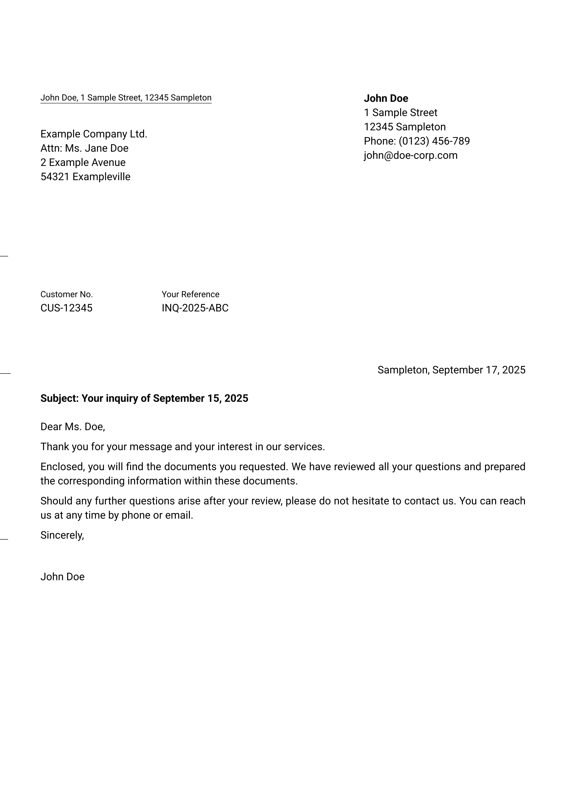

# typst Letter Template

[](LICENSE)
[](https://github.com/benediktclaus/letter/releases)
[](https://github.com/benediktclaus/letter/commits/main)

A simple yet flexible `typst` template for creating standard personal or business letters.

## Preview

This is what your finished letter could look like:



## Features

* **Easy to Use:** Apply the template to your document with a single `#show` rule.
* **Automatic Date:** The date is automatically set to the current day by default.
* **Flexible Reference Block:** Easily add a block for references like customer or invoice numbers.
* **Fold Marks:** Optional fold and punch marks can be displayed.
* **Customizable:** Many elements, like the sender block or the return address, can be toggled.
* **Automated Pagination:** Page numbering ("Page X of Y") automatically appears from the second page onward.

## Installation

This template requires a few dependencies to be installed manually to work as intended.

### Step 1: Install Required Fonts

This template is designed to use a specific font for optimal appearance. Please download and install it on your system from its official source:

* **[Roboto](https://fonts.google.com/specimen/Roboto):** Used for all text in the letter.

### Step 2: Install This Template

1.  **Download the Latest Release:** Go to the [Releases page](https://github.com/benediktclaus/letter/releases) and download the source code ZIP file of the latest version.
2.  **Find Your Local typst Package Directory:** You need to find the standard package directory for your operating system.
    * **Windows:** `%APPDATA%\typst\packages\` (e.g., `C:\Users\<YourName>\AppData\Roaming\typst\packages`)
    * **macOS:** `~/Library/Application Support/typst/packages/`
    * **Linux:** `~/.local/share/typst/packages/`
3.  **Move the Package Files:** Extract the downloaded ZIP file. Create the following folder structure inside your `packages` directory and move the extracted contents into it.
    `.../packages/local/letter/0.3.0/`
    Inside this `0.3.0` folder, you should place the `typst.toml` and `lib.typ` files.

## Usage

To use the template, import it at the top of your `.typ` file and call the `briefpapier` function within a `#show` rule. You pass all settings as arguments.

```typst
#import "@local/letter:0.3.0": *

#show: briefpapier.with(
  // -- Sender Information --
  show-absender: true,
  absender: [
    *John Doe*\
    1 Sample Street\
    12345 Sampleton\
    Phone: (0123) 456-789\
    john@doe-corp.com
  ],
  show-ruecksende: true,
  ruecksende-adresse: [John Doe, 1 Sample Street, 12345 Sampleton],
  
  // -- Recipient Address --
  adresse: [
    Example Company Ltd.\
    Attn: Ms. Jane Doe\
    2 Example Avenue\
    54321 Exampleville
  ],

  // -- Letter Details --
  referenzen: (
    ([Customer No.], [CUS-12345]),
    ([Your Reference], [INQ-2025-ABC]),
  ),
  betreff: [Subject: Your inquiry of September 15, 2025],
  ort: [Sampleton],
  datum: [September 17, 2025],

  // -- Display Options --
  ticks: true,

  // -- Closing --
  absender-gruss: [
    John Doe
  ],
)

// -- Letter Body --

Dear Ms. Doe,

Thank you for your message and your interest in our services.

Enclosed, you will find the documents you requested. We have reviewed all your questions and prepared the corresponding information within these documents.

Should any further questions arise after your review, please do not hesitate to contact us. You can reach us at any time by phone or email.

Sincerely,
```

## Parameters

The template is controlled by the `briefpapier()` function. Here are all available parameters:

| Parameter             | Type               | Default Value                              | Description                                                                                             |
| ----------------------- | -------------------- | ---------------------------------------- | ------------------------------------------------------------------------------------------------------------ |
| `absender`            | `content`          | `[]`                                       | A content block with the full sender details, placed in the top right.                                  |
| `show-absender`       | `boolean`          | `false`                                    | If `true`, the `absender` block is displayed.                                                           |
| `absender-gruss`      | `content`          | `[]`                                       | The closing block at the end of the letter, e.g., with name and job title.                              |
| `ruecksende-adresse`  | `content`          | `[]`                                       | A single-line return address for the window of an envelope.                                             |
| `show-ruecksende`     | `boolean`          | `false`                                    | If `true`, the `ruecksende-adresse` is displayed above the recipient's address field.                   |
| `adresse`             | `content`          | `[]`                                       | The recipient's address field.                                                                          |
| `ort`                 | `content`          | `[Dortmund]`                               | The city or location displayed before the date.                                                         |
| `betreff`             | `content`          | `[]`                                       | The subject line of the letter. Is automatically formatted in bold.                                     |
| `referenzen`          | `array` or `none`  | `none`                                     | An array of tuples for reference details. Example: `( ("Key", "Value"), )`.                             |
| `datum`               | `content` or `none`| `none`                                     | The date of the letter. If `none`, the current date in `DD.MM.YYYY` format is automatically used.       |
| `ticks`               | `boolean`          | `false`                                    | If `true`, fold and punch marks are displayed on the page margin.                                       |
| `body`                | `content`          | (required)                                 | The actual content (body text) of your letter.                                                          |

## Contributing & Feedback

This package is designed for practical use. If you have suggestions for improvements or encounter any issues, please feel free to [open an issue](https://github.com/benediktclaus/letter/issues).

## License

This project is licensed under the **MIT License**. See the `LICENSE` file for details.